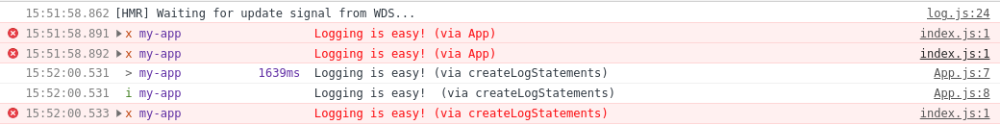

## About

A Simple [ulog](https://ulog.js.org/) demo that shows that the log configuration does not work as expected in some cases. See 
https://github.com/Download/ulog/issues/56 and https://github.com/Download/ulog/issues/50#issuecomment-810596191

## Details

### Log statements

```
const createLogStatements = () => {
  log.debug('Logging is easy! (via createLogStatements)')
  log.info('Logging is easy! (via createLogStatements)')
  log.error('Logging is easy! (via createLogStatements)')
}

function App() {
  log.debug('Logging is easy! (via App)')
  log.info('Logging is easy! (via App)')
  log.error('Logging is easy! (via App)')
  return (
    <div className="App">
      <header className="App-header">
        <button onClick={() => createLogStatements()}>Create log statements</button>
      </header>
    </div>
  );
}
```

### Result



The log statements

```
  log.debug('Logging is easy! (via App)')
  log.info('Logging is easy! (via App)')
```

are missing.

